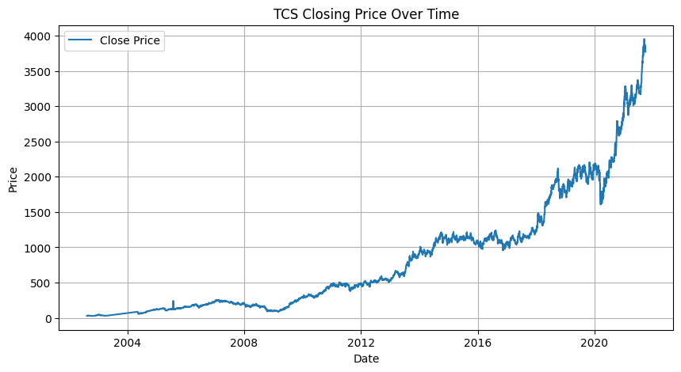
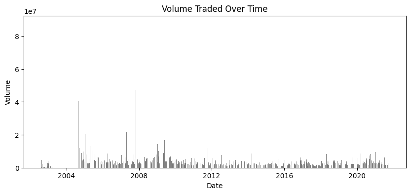
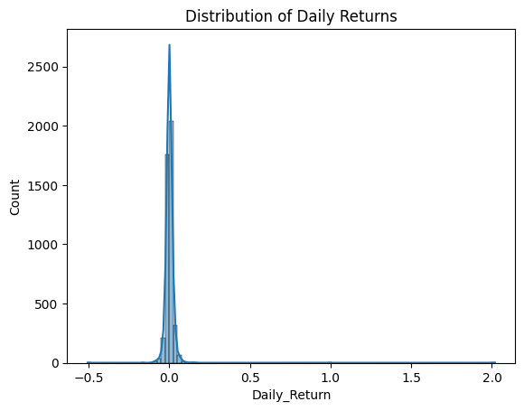
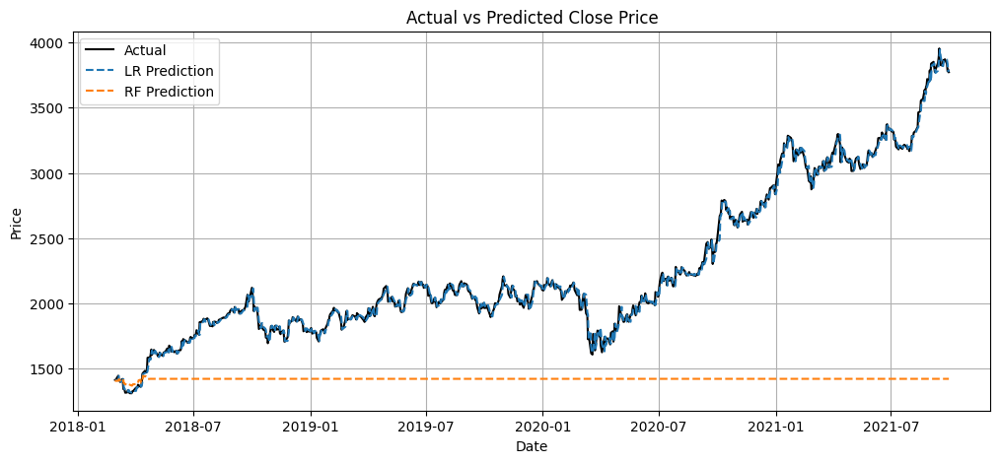
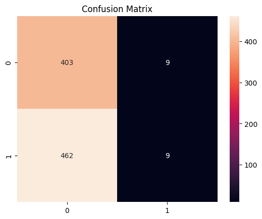
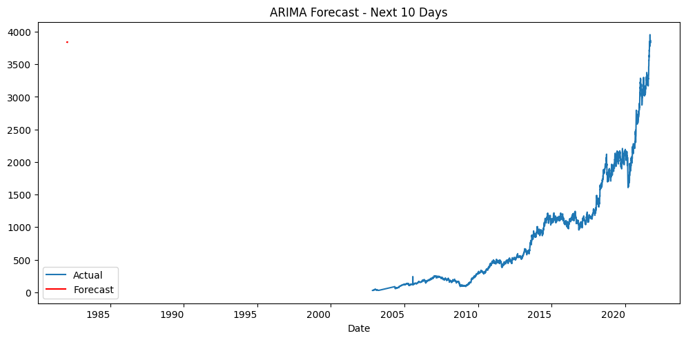

# 📈 TCS Stock Price Prediction using Machine Learning

Welcome to a machine learning project that dives deep into the stock price movement of **Tata Consultancy Services (TCS)**. Using historical stock data, this project leverages predictive modeling to forecast future prices, trends, and market volatility.

---

## 🧠 Project Goals

- Analyze TCS stock historical patterns
- Engineer technical features like Moving Averages, RSI
- Build models to:
  - Predict next-day closing price
  - Classify price movement (up/down)
  - Forecast multi-day future prices
  - Predict volatility zones
  - Model price using ARIMA for time series forecasting
- Visualize predictions vs actuals
- Evaluate model reliability with performance metrics

---

## 🧰 Tools & Libraries Used

- Python 🐍
- Jupyter Notebook 📓
- Pandas, NumPy
- Matplotlib, Seaborn, Plotly
- Scikit-learn
- Statsmodels (ARIMA)
- Random Forest, Linear Regression

---

## 📁 Dataset Description

- **TCS_stock_history.csv**  
  Daily OHLC (Open-High-Low-Close) stock data + volume  
- **TCS_stock_info.csv**  
  Fundamental metrics like P/E, Dividends, Book Value  
- **TCS_stock_action.csv**  
  Corporate actions: splits, dividends, bonuses

---

## 🔍 Exploratory Data Analysis (EDA)

Key insights:

- 📈 Historical price trend with line charts
- 📊 Volume traded spikes and dips
- 🔄 Moving Averages to smooth volatility
- 📉 Daily returns and volatility metrics

---

## 🏗️ Feature Engineering

- Lag Features: `Close_Lag1`, `Close_Lag5`
- Moving Averages: `MA20`, `MA50`
- Daily Returns
- Volatility Window (Rolling Std Dev)
- Price direction (binary)

---

## 🔮 Predictive Analyses

| # | Task | Model | Description |
|--|------|-------|-------------|
| 1 | **Next-day Price Prediction** | Linear Regression | Predicts closing price based on lag features |
| 2 | **Price Movement Classification** | Random Forest Classifier | Predicts if the next day will close higher or lower |
| 3 | **Volatility Prediction** | Random Forest Classifier | Classifies whether stock will enter high volatility |
| 4 | **3-Day Price Forecast** | Random Forest Regressor | Forecasts price 3 days in advance |
| 5 | **10-Day Time Series Forecast** | ARIMA | Forecasts future trend using classical model |

---

## 📈 Model Performance

### 🧪 Evaluation Metrics

| Model | MAE | RMSE | R² Score |
|-------|-----|------|----------|
| Linear Regression | `26.3964` | `37.0022` | `0.9961` |
| Random Forest Regressor | `848.3029` | `1032.0684` | `-2.0386` |

### 🎯 Classification Accuracy

- Price Movement (Up/Down): **46.65%**
- Volatility Classifier: **20.49%**

---

## 📊 Visuals

- ✅ Actual vs Predicted Line Charts
- ✅ Confusion Matrix for Classification
- ✅ Volatility warning overlays
- ✅ Multi-day prediction curves

---

## 🤔 What Did I Learn?

- 📉 Stock data is noisy and needs feature smoothing
- 🧠 Random Forest performs better than Linear Regression for short-term predictions
- 🔮 ARIMA models work well for pure time-series trend forecasting
- ✅ Binary trend classification is useful for building trading signals

---

## 🚀 Future Improvements

- Add LSTM model for sequential learning
- Include market sentiment (news or social media)
- Incorporate NIFTY 50 or sector-wide features
- Deploy as a Streamlit or Dash dashboard

---
## 📌 Conclusion & Insights

- **Trend Classification (Up/Down)** offers decent accuracy for short-term trading signals
- **Random Forest** models provided better generalization than linear ones
- **Volatility prediction** adds value in risk-sensitive trading strategies
- While no model is 100% accurate, they can *enhance decision making*

---

## ✍️ Closing Thoughts

Stock market prediction is complex and influenced by multiple unseen factors like news, market sentiment, and macroeconomics. However, this project demonstrates that with the right features and models, meaningful patterns can be extracted from historical data. 📊

This is just the beginning — the roadmap includes adding sentiment analysis, deploying this as a dashboard, and expanding the scope to multiple stocks.

---

